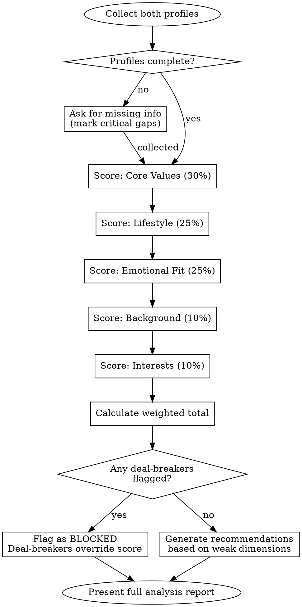

# 相亲对象分析匹配 (Xiangqin Matchmaking Analysis) Implementation Plan

> **For agentic workers:** REQUIRED SUB-SKILL: Use superpowers:subagent-driven-development (recommended) or superpowers:executing-plans to implement this plan task-by-task. Steps use checkbox (`- [ ]`) syntax for tracking.

**Goal:** Create a skill that analyzes compatibility between two potential partners based on multi-dimensional profile matching, providing structured assessment and actionable recommendations.

**Architecture:** Single SKILL.md skill file containing a structured analysis framework with profile templates, dimension scoring rubrics, and a decision flowchart. Uses the superpowers skill format with YAML frontmatter.

**Tech Stack:** Markdown skill document (no code runtime), designed for Claude Code / AI agent consumption.

---

## File Structure

| File | Purpose |
|------|---------|
| `skills/xiangqin-matching/SKILL.md` | Main skill document - profile templates, analysis framework, scoring rubric, recommendations |

No supporting files needed — the analysis framework fits within a single SKILL.md.

---

### Task 1: Define Skill Frontmatter and Overview

**Files:**
- Create: `skills/xiangqin-matching/SKILL.md`

- [ ] **Step 1: Create the skill directory**

Run: `mkdir -p skills/xiangqin-matching`

- [ ] **Step 2: Write the frontmatter and overview section**

Create `skills/xiangqin-matching/SKILL.md` with the following content:

~~~~markdown
---
name: xiangqin-matching
description: Use when analyzing compatibility between two people for a potential romantic relationship, evaluating match quality across multiple dimensions including values, lifestyle, interests, and life goals
---

# Xiangqin Matchmaking Analysis

## Overview

Structured multi-dimensional compatibility analysis for potential romantic partners. Provides objective assessment framework that goes beyond surface-level matching to evaluate deep compatibility factors.

**Core principle:** Good matches are built on aligned values and complementary traits, not identical profiles. This skill evaluates both alignment (shared direction) and complementarity (mutual support).

## When to Use

- Analyzing compatibility between two people considering a relationship
- Evaluating a potential match before a first meeting (相亲前评估)
- Reviewing compatibility after initial meetings (相亲后复盘)
- When asked to compare two profiles for match quality
- When seeking structured advice on a specific match

## When NOT to Use

- General dating advice (use dating-coaching skill instead)
- Helping draft messages or conversation topics
- Arranging dates or logistics planning
- Psychological counseling for relationship problems
~~~~

- [ ] **Step 3: Commit**

```bash
git add skills/xiangqin-matching/SKILL.md
git commit -m "feat: add xiangqin-matching skill frontmatter and overview"
```

---

### Task 2: Add Profile Template Section

**Files:**
- Modify: `skills/xiangqin-matching/SKILL.md`

- [ ] **Step 1: Append the profile template after "When NOT to Use" section**

Append the following content to `SKILL.md`:

~~~~markdown

## Profile Template

Before analysis, collect (or ask for) the following information for both parties. Mark missing fields and note which gaps matter most.

### Basic Profile

| Dimension | Person A | Person B |
|-----------|----------|----------|
| Age | | |
| Height | | |
| Education | | |
| Occupation | | |
| Income range | | |
| Location (city) | | |
| Hometown | | |
| Housing situation | | |

### Values and Life Goals

| Dimension | Person A | Person B |
|-----------|----------|----------|
| Marriage timeline | | |
| Children preference | | |
| Career ambition level | | |
| Financial management style | | |
| Religious/spiritual beliefs | | |
| Relationship with parents | | |
| Deal-breakers | | |

### Lifestyle and Personality

| Dimension | Person A | Person B |
|-----------|----------|----------|
| Introvert / Extrovert | | |
| Weekend preference (home vs out) | | |
| Health and fitness habits | | |
| Social circle size | | |
| Communication style | | |
| Conflict resolution style | | |
| Pet preferences | | |

### Interests and Hobbies

List top 3-5 interests for each person. Note overlaps and potential shared activities.

**Person A interests:**
1.
2.
3.

**Person B interests:**
1.
2.
3.

**Overlap / complementarity notes:**
~~~~

- [ ] **Step 2: Commit**

```bash
git add skills/xiangqin-matching/SKILL.md
git commit -m "feat: add profile template to xiangqin-matching skill"
```

---

### Task 3: Add Multi-Dimensional Analysis Framework

**Files:**
- Modify: `skills/xiangqin-matching/SKILL.md`

- [ ] **Step 1: Append the core analysis framework after Profile Template**

Append the following content to `SKILL.md`:

~~~~markdown

## Analysis Framework

Analyze compatibility across 5 dimensions. Score each on a 1-5 scale, then compute weighted total.

### Dimension 1: Core Values Alignment (Weight: 30%)

**What to evaluate:** Do both people want the same fundamental things from life?

| Factor | High Match (4-5) | Medium Match (2-3) | Low Match (1) |
|--------|-------------------|---------------------|----------------|
| Marriage timeline | Same timeframe within 1 year | Within 2-3 years | Opposite timelines or one unsure |
| Children preference | Fully aligned (both want or both don't) | One flexible, one decided | Strongly opposed preferences |
| Financial values | Similar spending/saving philosophy | Different but willing to compromise | Fundamentally opposed (e.g., saver vs spender with no middle ground) |
| Family involvement | Similar boundaries with extended family | Different but respectful | One expects enmeshment, other wants independence |

**Scoring guidance:**
- 5: All core values aligned, no significant gaps
- 4: Minor differences that are openly discussed and accepted
- 3: 1-2 meaningful differences requiring active compromise
- 2: Multiple value conflicts that will need ongoing negotiation
- 1: Fundamental incompatibility on key life decisions

### Dimension 2: Lifestyle Compatibility (Weight: 25%)

**What to evaluate:** Can both people comfortably share daily life?

| Factor | High Match (4-5) | Medium Match (2-3) | Low Match (1) |
|--------|-------------------|---------------------|----------------|
| Social energy | Similar introversion/extroversion level | One more social but understanding | Extreme mismatch causing resentment |
| Daily rhythm | Similar sleep/wake/activity patterns | Different schedules but adaptable | Incompatible daily rhythms |
| Health habits | Similar diet/exercise approach | Different but mutually supportive | One judges the other's habits |
| Living standards | Compatible expectations for home/lifestyle | Different but willing to adjust | Major gap in material expectations |

### Dimension 3: Emotional and Communication Fit (Weight: 25%)

**What to evaluate:** Can both people understand and support each other emotionally?

| Factor | High Match (4-5) | Medium Match (2-3) | Low Match (1) |
|--------|-------------------|---------------------|----------------|
| Expression style | Both comfortable sharing feelings | One more reserved but receptive | One shuts down, other demands expression |
| Conflict approach | Similar healthy conflict resolution | Different styles but willing to learn | Avoidant vs aggressive pattern |
| Affection language | Compatible love languages | Different but aware and adapting | Unmet affection needs on both sides |
| Emotional maturity | Both self-aware and responsible | Growing together with openness | Blame patterns or emotional volatility |

### Dimension 4: Background and Practical Fit (Weight: 10%)

**What to evaluate:** Practical factors affecting long-term viability.

| Factor | High Match (4-5) | Medium Match (2-3) | Low Match (1) |
|--------|-------------------|---------------------|----------------|
| Geographic alignment | Same city or willing to relocate | Open to discussion | Rigid location requirements that conflict |
| Family approval | Both families supportive | Some resistance but manageable | Strong family opposition |
| Education/culture gap | Similar cultural background | Different but mutually curious | Cultural friction with no interest in understanding |
| Economic parity | Similar financial standing or comfortable gap | Gap exists but expectations aligned | Significant gap causing tension |

### Dimension 5: Interest and Activity Overlap (Weight: 10%)

**What to evaluate:** Is there enough shared ground for enjoyment together?

| Factor | High Match (4-5) | Medium Match (2-3) | Low Match (1) |
|--------|-------------------|---------------------|----------------|
| Shared hobbies | 2+ overlapping interests | 1 shared interest plus willingness to explore | No overlap, neither willing to try |
| Activity energy | Similar activity preferences | Different but take turns choosing | One always compromising |
| Growth orientation | Both enjoy learning/trying new things | One leads, other follows happily | One stagnant, other frustrated |

### Overall Score Calculation

    Total = (Values x 0.30) + (Lifestyle x 0.25) + (Emotional x 0.25) + (Background x 0.10) + (Interests x 0.10)

| Total Score | Rating | Interpretation |
|-------------|--------|----------------|
| 4.0 - 5.0 | Strong Match | High compatibility, proceed with confidence |
| 3.0 - 3.9 | Good Potential | Solid foundation, watch specific growth areas |
| 2.0 - 2.9 | Cautious | Significant differences requiring honest conversation |
| 1.0 - 1.9 | Weak Match | Fundamental incompatibilities likely to cause friction |
~~~~

- [ ] **Step 2: Commit**

```bash
git add skills/xiangqin-matching/SKILL.md
git commit -m "feat: add multi-dimensional analysis framework with scoring rubric"
```

---

### Task 4: Add Analysis Decision Flowchart

**Files:**
- Modify: `skills/xiangqin-matching/SKILL.md`

- [ ] **Step 1: Append the analysis process with flowchart after Analysis Framework**

Append the following content to `SKILL.md`:

~~~~markdown

## Analysis Process



**Step-by-step process:**

1. **Collect profiles** using the Profile Template. If information is missing, ask for it. Mark which gaps are critical (values, deal-breakers) vs. nice-to-have (specific hobbies).

2. **Score each dimension** using the rubric. Provide specific justification for each score — for example, "Lifestyle: 3/5 because one is homebody and other prefers active social life, but both showed willingness to compromise."

3. **Check deal-breakers FIRST.** If either person has a hard deal-breaker that the other cannot meet, flag the match as BLOCKED regardless of total score. Common deal-breakers: children preference, location rigidity, religious requirements, existing relationship boundaries.

4. **Calculate total score** and assign rating.

5. **Generate targeted recommendations** focusing on the weakest 1-2 dimensions. Never give generic advice — every recommendation should reference specific profile details.
~~~~

- [ ] **Step 2: Commit**

```bash
git add skills/xiangqin-matching/SKILL.md
git commit -m "feat: add analysis decision flowchart and step-by-step process"
```

---

### Task 5: Add Output Report Template, Quick Reference, and Common Mistakes

**Files:**
- Modify: `skills/xiangqin-matching/SKILL.md`

- [ ] **Step 1: Append the output report template and closing sections**

Append the following content to `SKILL.md`:

~~~~markdown

## Output Report Template

When presenting analysis results, use this structure:

    # 相亲匹配分析报告

    ## 基本信息
    [One-paragraph summary of both parties]

    ## 匹配总评
    **总分:** X.X / 5.0 — [Rating Label]

    ## 各维度评分

    | 维度 | 得分 | 权重 | 加权分 |
    |------|------|------|--------|
    | 核心价值观 | X/5 | 30% | X.XX |
    | 生活方式 | X/5 | 25% | X.XX |
    | 情感沟通 | X/5 | 25% | X.XX |
    | 背景条件 | X/5 | 10% | X.XX |
    | 兴趣爱好 | X/5 | 10% | X.XX |

    ## 亮点 (Strengths)
    1. [Specific strength with profile evidence]
    2. [Specific strength with profile evidence]

    ## 风险点 (Concerns)
    1. [Specific concern with profile evidence]
    2. [Specific concern with profile evidence]

    ## 建议 (Recommendations)
    1. **[Focus area]:** [Specific, actionable advice tied to profile details]
    2. **[Focus area]:** [Specific, actionable advice tied to profile details]

    ## 一票否决项检查
    - [ ] 子女意愿: [Aligned / CONFLICT]
    - [ ] 地理位置: [Aligned / CONFLICT]
    - [ ] 其他硬性条件: [Aligned / CONFLICT]

## Quick Reference

| What you need | Where to look |
|---------------|---------------|
| Profile template | Fill in the Profile Template tables |
| How to score a dimension | Check the rubric table in that dimension section |
| Is it a deal-breaker? | Values dimension deal-breaker factors |
| How to present results | Use the Output Report Template |
| What do scores mean | Overall Score Calculation table |

## Common Mistakes

| Mistake | Correction |
|---------|------------|
| Treating all dimensions equally | Values (30%) and Lifestyle/Emotional (25% each) matter far more than Interests (10%) |
| Scoring based on similarity alone | Complementary traits score high too (e.g., one plans, one adapts) |
| Ignoring deal-breakers | A 4.5 score with a children-preference conflict is still BLOCKED |
| Giving generic advice | Every recommendation must reference specific profile details |
| Over-weighting surface traits | Height, looks, and income belong in Background (10%), not Values (30%) |
| One-sided analysis | Always evaluate from BOTH perspectives — compatibility is mutual |
| Ignoring growth potential | People adapt. Score current state, but note willingness to grow as a positive signal |

## The Bottom Line

**Good matches are not found — they are evaluated.** A structured analysis prevents both settling for surface compatibility and dismissing a strong match because of one fixable gap. Score honestly, flag deal-breakers early, and recommend specific growth areas.
~~~~

- [ ] **Step 2: Commit**

```bash
git add skills/xiangqin-matching/SKILL.md
git commit -m "feat: add output report template, quick reference, and common mistakes"
```

---

### Task 6: Final Review and Validation

**Files:**
- Read: `skills/xiangqin-matching/SKILL.md`

- [ ] **Step 1: Read the complete skill file end-to-end**

Read `skills/xiangqin-matching/SKILL.md` in full and verify:
1. All sections flow logically
2. No placeholders (TBD, TODO, etc.)
3. Table formatting is correct
4. Frontmatter has valid `name` and `description` fields
5. Flowchart DOT syntax is valid

- [ ] **Step 2: Fix any issues found during review**

Edit any problems discovered in Step 1.

- [ ] **Step 3: Commit (if fixes were needed)**

```bash
git add skills/xiangqin-matching/SKILL.md
git commit -m "fix: polish xiangqin-matching skill after review"
```
