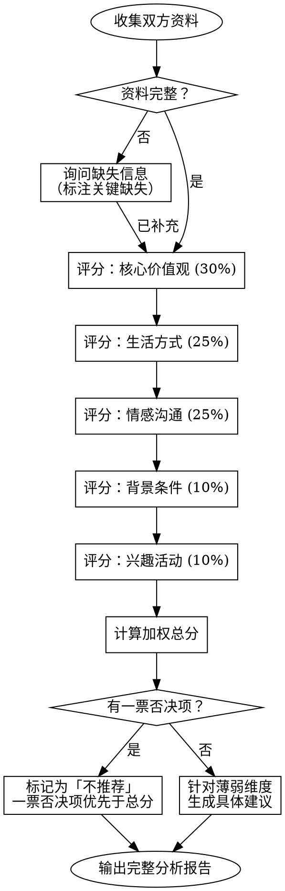

# 相亲匹配分析

## 概述

结构化的多维度相亲匹配度分析框架，帮助客观评估两个潜在伴侣之间的深层契合度。

**核心原则：** 好的匹配建立在价值观一致和性格互补之上，而非表面条件的堆叠。本技能同时评估方向一致性（共同目标）和互补性（相互支持）。

**适用场景：** 本技能充分考虑中国相亲市场的特殊文化背景，包括户口、房产、彩礼、编制等中国特色因素。

## 何时使用

- 分析两个人之间的相亲匹配度
- 相亲前评估潜在对象是否合适
- 相亲后复盘双方契合程度
- 比较两个不同候选人的匹配质量
- 需要结构化建议某个具体配对时

## 何时不适用

- 约会聊天话术指导
- 安排约会行程或地点
- 恋爱关系中的心理辅导
- 婚姻危机处理和调解

## 个人资料模板

分析前，先收集（或询问）以下信息。标注缺失字段，区分关键缺失和次要缺失。

### 基本条件

| 维度 | 甲方 | 乙方 |
|------|------|------|
| 年龄 | | |
| 身高 | | |
| 学历（含院校层次：985/211/双一流/普通本科/大专） | | |
| 职业 | | |
| 是否编制/体制内 | | |
| 月收入范围 | | |
| 所在城市 | | |
| 户口所在地 | | |
| 房产情况（有无、位置、是否还贷） | | |
| 车辆情况 | | |
| 籍贯/老家 | | |

### 价值观与人生目标

| 维度 | 甲方 | 乙方 |
|------|------|------|
| 预期结婚时间 | | |
| 生育意愿（要/不要/随缘/几个） | | |
| 彩礼/嫁妆期望 | | |
| 父母养老安排 | | |
| 过年去谁家 | | |
| 与原生家庭边界感 | | |
| 理财观念（储蓄/消费/投资） | | |
| 宗教信仰 | | |
| 底线条件（不可妥协项） | | |

### 生活方式与性格

| 维度 | 甲方 | 乙方 |
|------|------|------|
| 内向/外向 | | |
| 周末偏好（宅家/外出） | | |
| 作息规律 | | |
| 健身运动习惯 | | |
| 朋友圈大小 | | |
| 沟通方式（直接/委婉） | | |
| 冲突处理方式 | | |
| 宠物偏好 | | |

### 兴趣爱好

列出双方各 3-5 个主要兴趣，标注重叠和互补项。

**甲方兴趣：**
1. 
2. 
3. 

**乙方兴趣：**
1. 
2. 
3. 

**重叠/互补分析：**

## 分析框架

从五个维度评估匹配度，每个维度 1-5 分，最后计算加权总分。

### 维度一：核心价值观一致性（权重 30%）

**评估重点：** 双方对人生的根本追求是否一致？

| 因素 | 高匹配（4-5分） | 中等匹配（2-3分） | 低匹配（1分） |
|------|-----------------|-------------------|---------------|
| 结婚时间线 | 一致或在1年以内可协调 | 相差2-3年但双方可沟通 | 一方迫切一方犹豫不决 |
| 生育意愿 | 完全一致（都要或都不要） | 一方灵活一方已决定 | 强烈对立的偏好 |
| 理财观念 | 消费观和储蓄观相近 | 有差异但愿意妥协 | 根本对立（如一个极攒一个极花） |
| 家庭边界 | 与原生家庭边界感相似 | 不同但互相尊重 | 一方要求融合，一方要求独立 |
| 父母养老 | 方案基本一致 | 有差异但愿意讨论 | 完全不同的养老观念导致冲突 |

**评分参考：**
- 5分：核心价值观完全一致，无重大分歧
- 4分：有细微差异但已公开讨论并接受
- 3分：1-2项重大分歧需要积极磨合
- 2分：多项价值观冲突，需要持续协商
- 1分：在关键人生决策上存在根本性不合

### 维度二：生活方式匹配度（权重 25%）

**评估重点：** 双方能舒适地共享日常生活吗？

| 因素 | 高匹配（4-5分） | 中等匹配（2-3分） | 低匹配（1分） |
|------|-----------------|-------------------|---------------|
| 社交能量 | 内外向程度相似 | 一方更爱社交但理解对方 | 极端不匹配导致一方抱怨 |
| 作息节奏 | 起居时间相近 | 不同步但可以适应 | 完全不兼容的作息 |
| 饮食习惯 | 口味和饮食观念相近 | 不同但互相包容 | 一方对另一方饮食习惯有评判 |
| 居住期望 | 对居住标准和地段期望一致 | 不同但愿意调整 | 物质期望差距过大 |
| 消费水平 | 日常花销观念相近 | 有差异但能商量 | 消费观差距导致频繁争执 |

### 维度三：情感沟通契合度（权重 25%）

**评估重点：** 双方在情感层面能否互相理解和支持？

| 因素 | 高匹配（4-5分） | 中等匹配（2-3分） | 低匹配（1分） |
|------|-----------------|-------------------|---------------|
| 表达方式 | 都愿意分享内心感受 | 一方含蓄但愿意倾听 | 一方封闭一方过度索取表达 |
| 冲突方式 | 健康的冲突处理方式 | 不同风格但愿意学习 | 回避型 vs 爆发型模式 |
| 情感需求 | 爱的语言兼容 | 不同但意识到了在调整 | 双方的情感需求持续得不到满足 |
| 情绪成熟度 | 都有自我觉察和责任感 | 在成长中保持开放 | 习惯性甩锅或情绪失控 |
| 婆媳/岳婿关系预期 | 对姻亲关系有合理预期 | 有差异但愿意沟通 | 一方要求对方完全迁就自己父母 |

### 维度四：背景条件适配度（权重 10%）

**评估重点：** 影响长期可行性的现实因素。（注意：此维度权重较低，因为物质条件可变，价值观才是核心。）

| 因素 | 高匹配（4-5分） | 中等匹配（2-3分） | 低匹配（1分） |
|------|-----------------|-------------------|---------------|
| 地理一致性 | 同城或愿意迁移 | 愿意讨论协商 | 地域要求僵化且冲突 |
| 户口一致性 | 户口无障碍或已有解决方案 | 有差异但不在意 | 户口问题影响子女教育等重大事项 |
| 家庭认可 | 双方家庭支持 | 有阻力但可控 | 家庭强烈反对 |
| 学历匹配 | 学历层次相当 | 有差距但心态平等 | 学历差距导致心态失衡 |
| 经济匹配 | 经济条件相当或差距可接受 | 有差距但期望对齐 | 经济差距导致关系紧张 |
| 彩礼/嫁妆 | 双方及家庭预期一致 | 有差异但愿意商量 | 预期差距大且僵持不下 |
| 编制偏好 | 对体制内外无硬性要求 | 有偏好但不强制 | 一方强制要求对方必须体制内/外 |

### 维度五：兴趣活动重叠度（权重 10%）

**评估重点：** 双方是否有足够的共同点来享受共处时光？

| 因素 | 高匹配（4-5分） | 中等匹配（2-3分） | 低匹配（1分） |
|------|-----------------|-------------------|---------------|
| 共同爱好 | 2个以上重叠兴趣 | 1个共同兴趣且愿意探索 | 无重叠且都不愿意尝试 |
| 活动能量 | 活动偏好强度相近 | 不同但轮流选择 | 一方总是妥协 |
| 成长意愿 | 都享受学习和尝试新事物 | 一方引领一方愉快跟随 | 一方停滞一方焦虑 |

### 总分计算

    总分 = 价值观 x 0.30 + 生活方式 x 0.25 + 情感沟通 x 0.25 + 背景条件 x 0.10 + 兴趣活动 x 0.10

| 总分 | 评级 | 解读 |
|------|------|------|
| 4.0 - 5.0 | 强匹配 | 高度契合，可放心推进 |
| 3.0 - 3.9 | 有潜力 | 基础扎实，关注需要成长的领域 |
| 2.0 - 2.9 | 需谨慎 | 存在显著差异，需要坦诚沟通 |
| 1.0 - 1.9 | 弱匹配 | 根本性不合，大概率会产生持续摩擦 |

## 分析流程

**五步分析法：**

1. **收集信息** —— 使用个人资料模板。信息不全时主动询问。区分关键缺失（价值观、底线条件）和次要缺失（具体爱好）。

2. **逐维度评分** —— 使用评分标准表。每个分数必须有具体依据，例如"生活方式：3/5，因为一方宅家一方爱社交，但双方都表示愿意妥协"。

3. **优先检查一票否决项** —— 任何一方有硬性底线条件对方无法满足的，直接标记为「不推荐」，无论总分多高。常见一票否决项：生育意愿、地域限制、彩礼分歧、宗教要求。

4. **计算总分并定级** —— 按加权公式计算，对照评级表。

5. **生成针对性建议** —— 聚焦最薄弱的1-2个维度，给出具体、可操作的建议。绝不给笼统的建议——每条建议都要引用具体的个人资料细节。
